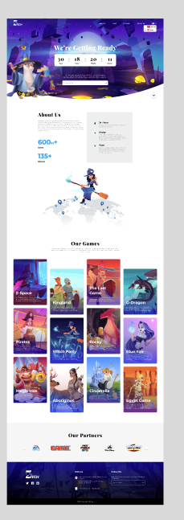

-install project `npm install`
-run project `npm run dev`

in [Section `Features`] `https://github.com/HuyNguyen243/NEVEL_GAME_STORE_TEST`

in [Section `Features`] `https://vercel.com/huynhs-projects-06252a68/nevel-game-store-test/ARtM6o8wV1tLJqjSgvfkBsHqhuof`



```js
// eslint.config.js
import react from "eslint-plugin-react";

export default tseslint.config({
  // Set the react version
  settings: { react: { version: "18.3" } },
  plugins: {
    // Add the react plugin
    react,
  },
  rules: {
    // other rules...
    // Enable its recommended rules
    ...react.configs.recommended.rules,
    ...react.configs["jsx-runtime"].rules,
  },
});
```
